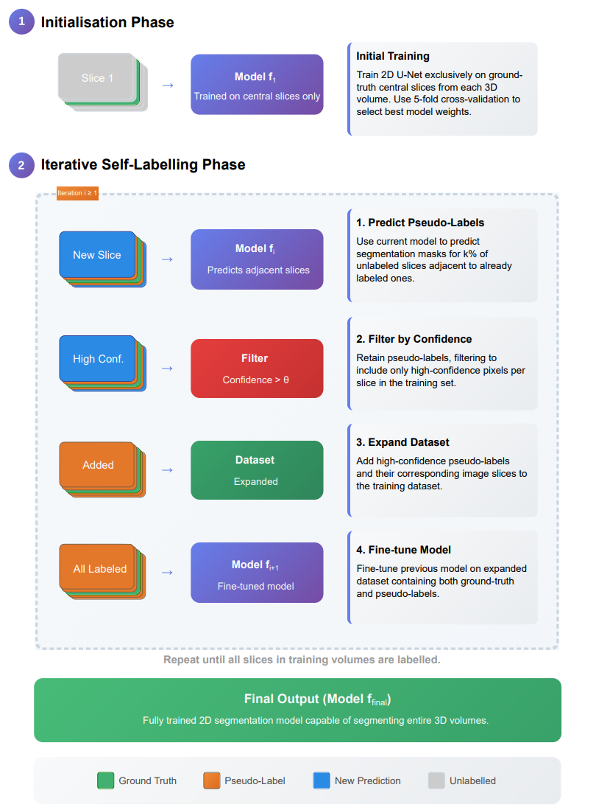

# Incremental-2D-Self-Labelling-for-Effective-3D-Medical-Volume-Segmentation-with-Minimal-Annotations

Repo for code relating to the paper entitled *"Incremental 2D Self-Labelling for Effective 3D Medical Volume Segmentation with Minimal Annotations"*.

This repository provides a self-labelling framework designed for 3D medical image segmentation (CT, MRI, mp-MRI formats) using TensorFlow. The process begins with just a single annotated 2D slice from a 3D volume and iteratively trains a U-Net model to pseudo-label adjacent slices, progressively labelling the entire training data. This approach significantly reduces the initial annotation burden, and can provide performance enhancements for medical image segmentation with sparse annotations.



---

## 📂 File Structure

All Python source code is located in the `scripts/` directory. Your data should be organised as shown below and is assumed to be .nii.gz format:

    repository-root/
    ├── scripts/
    │   ├── train.py              # Entry point for starting the training process
    │   ├── evaluate.py           # Entry point for evaluating a trained model
    │   ├── engine.py             # Core self-training and prediction logic
    │   ├── model.py              # U-Net architecture definition
    │   └── data_loader.py        # Data loading and preprocessing pipelines
    │
    ├── data/
    │   ├── original_dataset/     # Your initial dataset
    │   │   ├── imagesTr/
    │   │   │   └── volume-001.nii.gz
    │   │   └── labelsTr/
    │   │       └── volume-001.nii.gz
    │   │
    │   └── test_dataset/         # Your hold-out test set
    │       ├── imagesTs/
    │       └── labelsTs/
    │
    └── README.md

---

## ⚙️ Setup and Installation

To set up the environment for this project:

1. Create the Conda environment with the required dependencies:

    ```bash
    conda env create -f environment.yml
    ```

2. Activate the environment (replace `your-environment-name` with the actual name):

    ```bash
    conda activate your-environment-name
    ```

3. Install additional pip dependencies if needed:

    ```bash
    pip install -r requirements.txt
    ```

---

## 🚀 Usage

The entire workflow is managed through command-line scripts.

### 1. Training the Model

The self-training process is initiated using `train.py`. This script supports two ground-truth scenarios:

- Your labels are full 3D volumes.
- Your labels are pre-extracted 2D central slices (real-world scenario).

The script starts by training on the central slice of your original data, then iteratively predicts on neighbouring slices, adds confident predictions to the training set, and retrains the model.

Example Command (Standard Case: Full 3D Labels):

    python scripts/train.py /
        --original_data_dir /path/to/your/data/original_dataset /
        --output_dir /path/to/your/training_output /
        --epochs_per_iteration 20 /
        --batch_size 16 /
        --lr 0.0001 /
        --confidence_threshold 0.8

Example Command (Real-World Case: Pre-extracted 2D Labels):

    python scripts/train.py /
        --original_data_dir /path/to/your/data/original_dataset /
        --output_dir /path/to/your/training_output /
        --labels_are_2d_slices

Key Arguments:

- `--original_data_dir`: (Required) Path to the dataset containing the initial annotated volumes.
- `--output_dir`: (Required) Path to a directory where generated pseudo-labels, model checkpoints, and logs will be saved.
- `--labels_are_2d_slices`: (Optional) Add this flag if your ground-truth labels are 2D files, each corresponding to the central slice of a 3D image volume.
- `--epochs_per_iteration`: Number of epochs to train during each expansion loop.
- `--batch_size`: Batch size per GPU.
- `--confidence_threshold`: The probability threshold (0.0 to 1.0) required to accept a model's prediction as a new pseudo-label.

---

### 2. Evaluating the Final Model

Once the training process is complete, a final model checkpoint (`best_model.h5`) will be available in your output directory. You can evaluate its performance on a separate, unseen test set using `evaluate.py`.

    python scripts/evaluate.py /
        --model_weights /path/to/your/training_output/checkpoints/best_model.h5 /
        --test_data_dir /path/to/your/data/test_dataset /
        --batch_size 32

Key Arguments:

- `--model_weights`: (Required) Path to the final `.h5` model checkpoint file.
- `--test_data_dir`: (Required) Path to the hold-out test set, which must contain `imagesTs` and `labelsTs` subdirectories.

---

## 📜 License

This repository is licensed under the MIT License. See the `LICENSE` file for details.

If you intend to use this repository for commercial purposes, please verify the licences of all Python packages used.

---

## 📚 Citation

If you use this code, please cite:

    TBD
